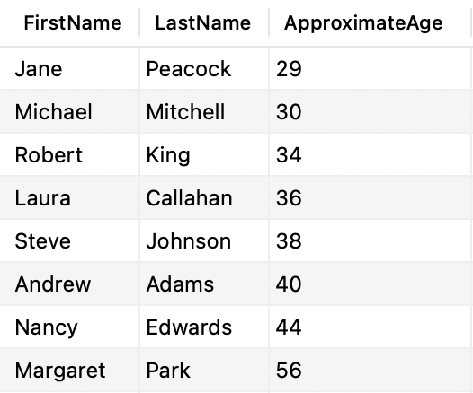

## approximate-age

### Instructions

Select the `FirstName` and `LastName` of each employee and you must calculate their approxmate ages with alias `ApproximateAge`.

### Expected result

### Notions

- [sql.sh/cours/create-table](https://sql.sh/cours/create-table)
