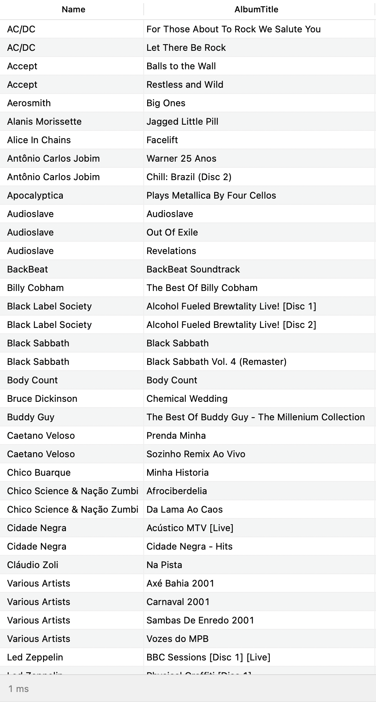

## left-join

### Instructions

Make a **left join** between the `artists` and `albums` table.

You must list the 100 first rows with :

- the artist name `Name`
- the album name `Title` with alias `AlbumName`

You must use `LEFT JOIN` because an artist may or may not have an album.

### Expected result

### Notions

- [sql.sh/cours/jointures](https://sql.sh/cours/jointures)
- [sql.sh/cours/jointures/left-join](https://sql.sh/cours/jointures/left-join)
